# Super Blog 

- Backend: Node.js - Express.js - MongoDB
- Frontend: React.js - Redux - React Router - Tailwind CSS

## Features

- User Authentication
- User Profile
- All Crud Operations
- Sending Emails
- User - Post, Post - Comment, User - Comment Relations
- and more ...

## Usage 
```bash
# Clone the repository
git clone https://github.com/ademhatay/super-blog.git

# Go inside the directory
cd super-blog

# Install dependencies
cd backend && npm install
cd frontend && npm install

# Create .env file in both backend and frontend directories
# and add your environment variables

# Run the app
cd backend && npm start
cd frontend && npm start
```

## Contributing
Pull requests are welcome. For major changes, please open an issue first to discuss what you would like to change.

Please make sure to update tests as appropriate.

## Screenshots

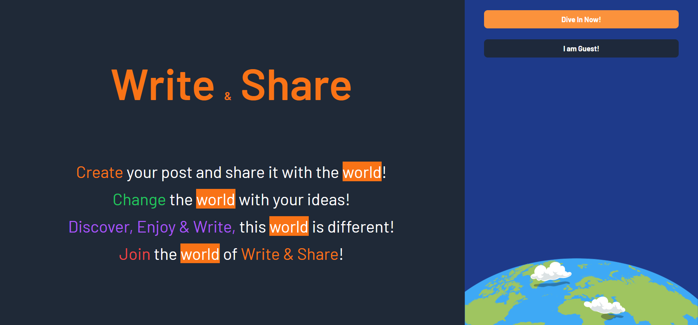
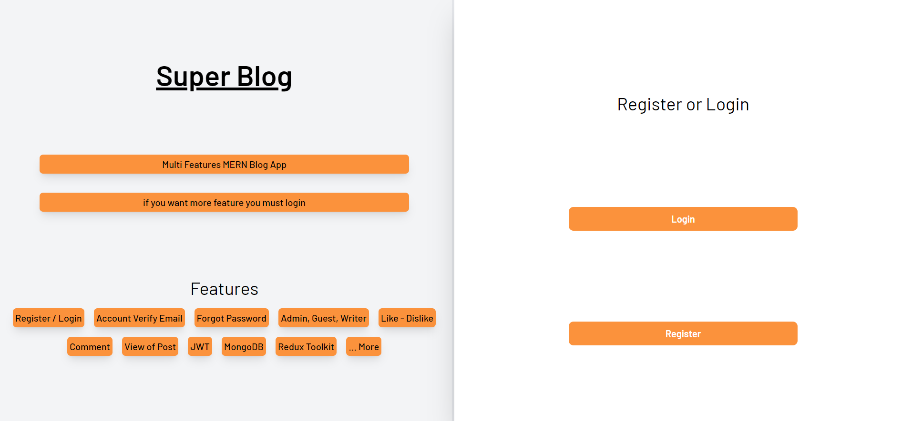
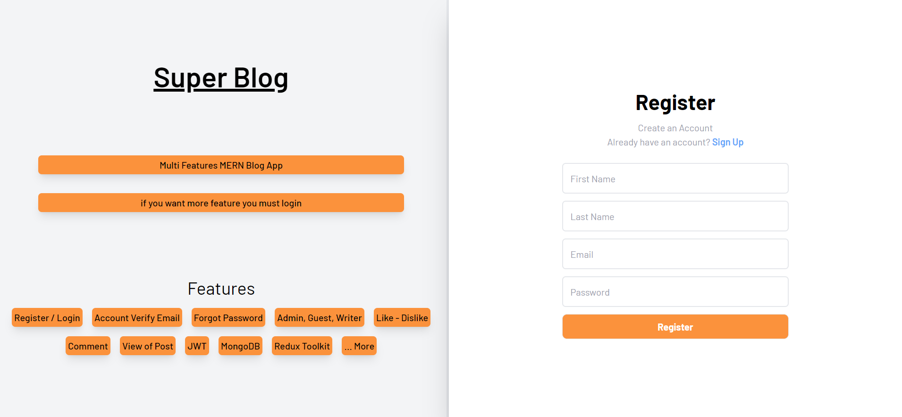
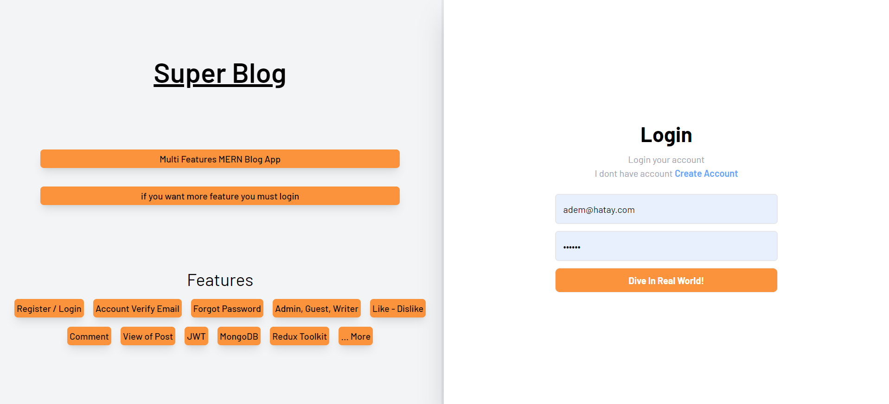
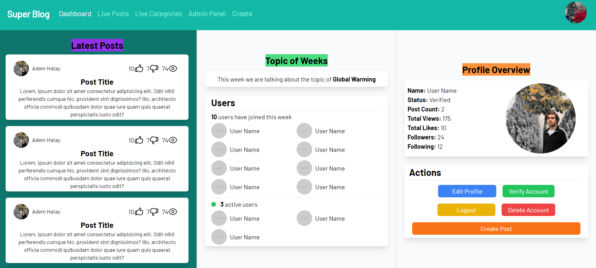
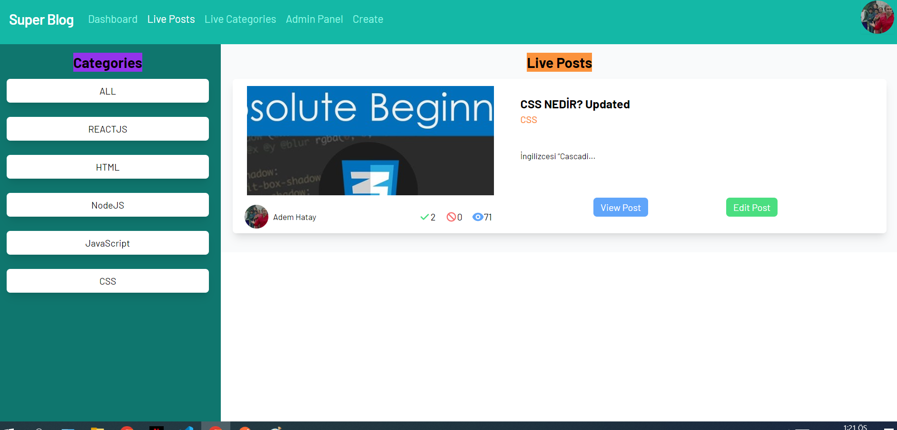
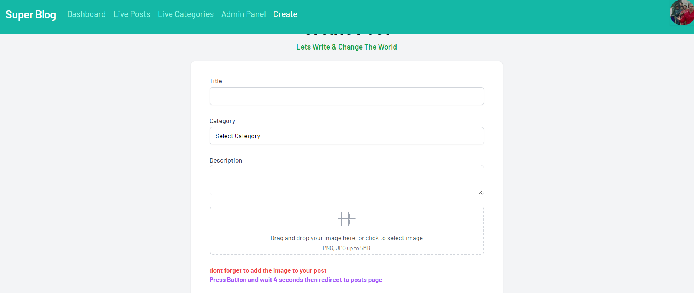
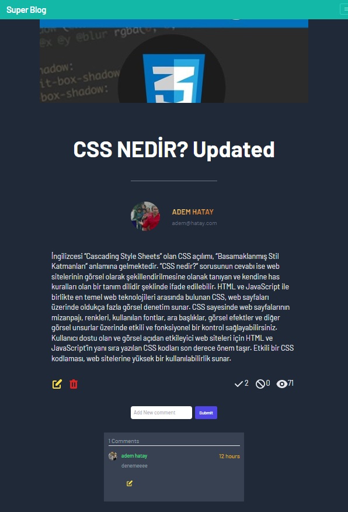
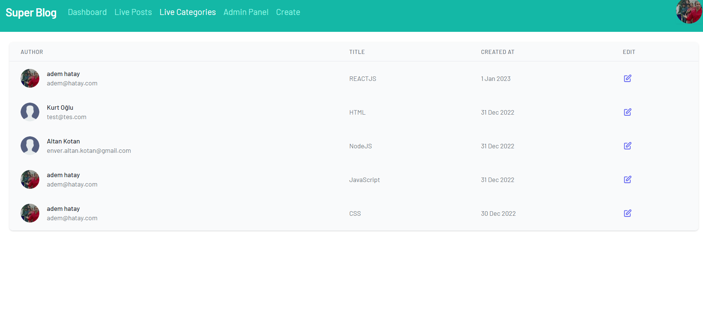
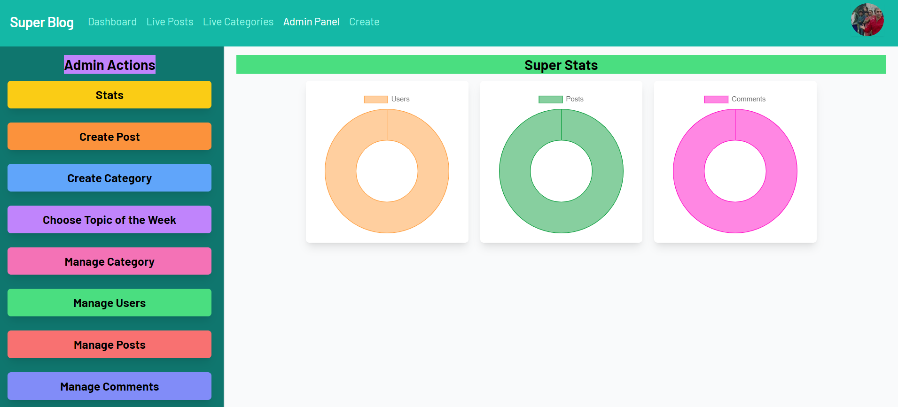
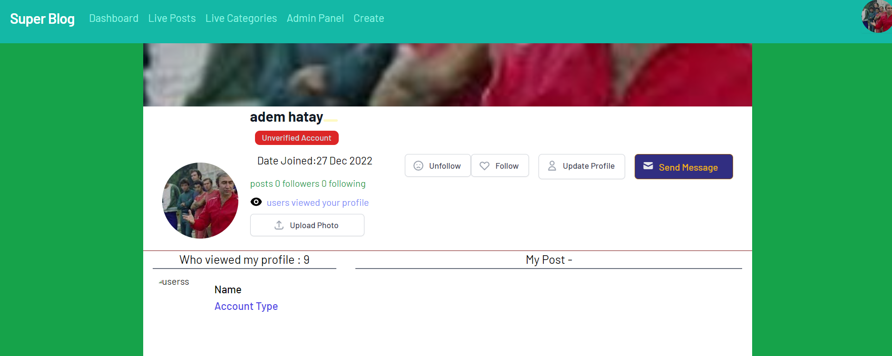


## License
[GPL-3.0](https://choosealicense.com/licenses/gpl-3.0/)